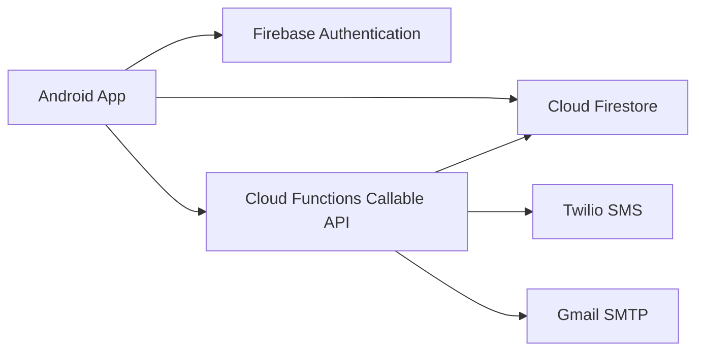

# Architecture Overview

## App Layers

- UI Activities and XML layouts
- Adapter layer for RecyclerView rendering
- Service layer for policy logic and Firebase data access
- Model layer for user, event, reservation entities

## Security and Access Control

- Role and status checks in app logic
- Firestore security rules enforce signed-in access and role restrictions
- Organizer management restricted to admin role

## Reservation Integrity

- Ticket decrement/increment operations use Firestore transactions
- Reservation cancellation is idempotent through status checks
